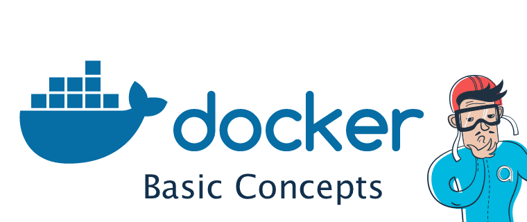

<p align="center">
  
</p>

# 🎯 Learning Objectives

1. **🐳 Understanding `Docker` and `Compose`**
2. **📚 Discover the different points of the subject of Inception**
3. **⚙️ Set up the NGINX container**
4. **💾 Set up the MariaDB container**
5. **📝 Set up the WordPress container**
6. **🔗 Connect the containers with Docker Compose**
7. **📦 Understanding the volumes of Docker Compose**
8. **✅ Finalize the project**

#### 🐳 1. Understanding Docker

📌 The advantage of Docker is clear: it solves one of the biggest problems developers face:
> **👉 Creating a great program on your computer and then realizing it only works on your own machine. To use it elsewhere, you need to install the required dependencies 🤯**

Remember that awesome program you found on GitHub? You follow the ReadMe tutorial 📄 to install it, but the installation crashes, showing an error like "You have missing dependencies" or "This version of the file is not compatible with your OS" 😣

👉
Yes, you could still be a good developer and provide a great script to install these dependencies, but you can’t predict whether the user is on Mac, Linux, or if they’re using such an old OS version that it doesn't even recognize your dependencies.

**Spending 4 hours debugging software that isn’t ours and realizing we won’t succeed tends to drive us crazy 🤯**

That's probably what happened to Solomon Hykes, a Franco-American who eventually asked himself whether it was possible to find a solution to this kind of problem. In response to this, he released Docker on March 20, 2013. 

> **🎯 Reminder from the Docker Wiki: Docker is a tool that can package an application and its dependencies into an isolated container.**

<details>
  <summary><strong  style="font-size: 18px; font-weight: bolder;">⚙️ Types of Problems Docker Solves</strong></summary>

- A dependency is not compatible with your software version 😅
- You already have the dependency but in a different version 😑
- Your dependency doesn’t exist on your OS 😓
- Your dependency crashes at launch 😮‍💨
- etc…

</details>

```
💪 So Docker came to solve the problem of managing dependencies and ensuring that software runs consistently across different environments. With Docker, developers can package their applications and all required dependencies into isolated containers, making it easier to deploy, run, and scale software on any machine, regardless of its operating system or configuration
```

### Why Do Developers Use Docker? 🤔

**The great advantage of Docker is the ability to model each container as an image that can be stored locally.**

🔎 A container is a virtual machine without a kernel.

📌 By "kernel," I mean the entire system that allows the virtual machine to function, including the OS, graphical side, network, etc.

🔎 In other words, a container only contains the application and its dependencies.

### Docker Hub

Docker provides a sort of App Store, containing images (containers) from thousands of people, making its usage even easier. 👍

Imagine that you want to host a website. For example, you would need to install NGINX. 
Install it on your computer? Haven’t you learned the lesson? What if you don’t have the right OS or the correct dependencies?

🤔 We would need a Docker container that installs NGINX for us.

😏 Well, as luck would have it, the NGINX image has been published by **NGINX on Docker Hub!** 🥳

Let’s take a look at an example of what an NGINX image might look like:

```Dockerfile
FROM    alpine:3.12

RUN     apk update && apk upgrade && apk add    \
        openssl         \
        nginx           \
        curl            \
        vim             \
        sudo

RUN     rm -f /etc/nginx/nginx.conf

COPY    ./config/nginx.conf /etc/nginx/nginx.conf
COPY    scripts/setup_nginx.sh /setup_nginx.sh

RUN     chmod -R +x /setup_nginx.sh

EXPOSE  443

ENTRYPOINT  ["sh", "setup_nginx.sh"]
```
```
👉 This file is a Dockerfile. It’s the main file for your Docker images. When you talk about a Dockerfile, you're introducing a new programming language, but don’t run away — it’s just about learning these few keywords
```

### Some Dockerfile keywords :
<details>
  <summary><strong  style="font-size: 20px; font-weight: bolder;">FROM</strong></summary>

Allows you to tell Docker which OS your virtual machine should run on.

This is the first keyword in your Dockerfile and is mandatory .

The most common are debian:buster for Debian or alpine:x:xx for Linux 

</details>

<details>
  <summary><strong  style="font-size: 20px; font-weight: bolder;">RUN</strong></summary>

Allows you to run a command on your virtual machine
```
💡The equivalent of logging in via ssh, then typing a bash command, like: echo “Hello World!”,which will print….
```
In general, the first **RUN** provided in the Dockerfile consist of updating your VM's resources, such as apk, or adding basic utilities like vim , curl or sudo .
</details>

<details>
  <summary><strong  style="font-size: 20px; font-weight: bolder;">COPY</strong></summary>
  
You got it! This actually allows you to copy a file.

## Copy it? From where?
You simply indicate where your file to copy is located from the directory where your Dockerfile is located, then where you want to copy it in your virtual machine.
```
💡A docker image is a folder, it necessarily contains your **Dockerfile** at the root of the folder but can also contain a bunch of other files so you can then copy them directly into your VM
```
</details>

<details>
  <summary><strong  style="font-size: 20px; font-weight: bolder;">EXPOSED</strong></summary>
 Here it's a question of network 📡

The instructionEXPOSEDinforms Docker that the container is listening on the specified network ports at runtime.EXPOSEDdoes not make container ports accessible to the host.

Wait! What? The container is listening on the network port and is not accessible to the host?

What does this mean? 😣

The instructionEXPOSEDexposes the specified port and makes it available only for inter-container communication. Let's understand this with an example.

Let's say we have two containers, a WordPress application and a MariaDB server. Our WordPress application needs to communicate with the MariaDB server for several reasons.


In order for the WordPress application to talk to the MariaDB server, the WordPress container must expose the port. Take a look at the Dockerfile of the official WordPress image and you will see a line sayingEXPOSED3306. This is what helps the two containers communicate with each other.

So when your WordPress container tries to connect to the port3306of the MariaDB container, this is the instructionEXPOSEDwhich makes this possible.

Note: For the WordPress server to communicate with the MariaDB container, it is important that both containers are running in the same docker network
</details>

<details>
  <summary><strong  style="font-size: 20px; font-weight: bolder;">ENTRYPOINT</strong></summary>
Yay! Your container looks ready to go.

However, it would probably be more judicious to ask the container to launch a certain command when it is launched.

This is what the keyword allows you to doENTRYPOINT!

Simply state your command, argument by argument, in the following format:
``` Bash
[ENTRYPOINT “bash” , ”-c”, “"$(echo Hello)"” ]
```
</details>


